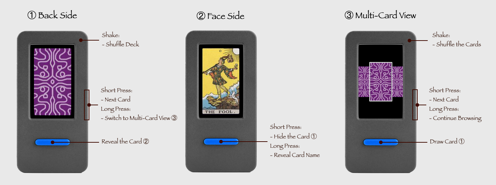

## How to Use

### Single Card Mode

- Shake the device to shuffle the deck.
- Press the side button to browse cards.
- Press the blue button to reveal or hide the current card.
- Long press the blue button to display the card name.

### Multi-Card View

- Shake the device to shuffle the deck.
- Press the side button to browse cards.
- Press the blue button to draw the selected card.
- Long press the side button to continue browsing.

## Control Guide

